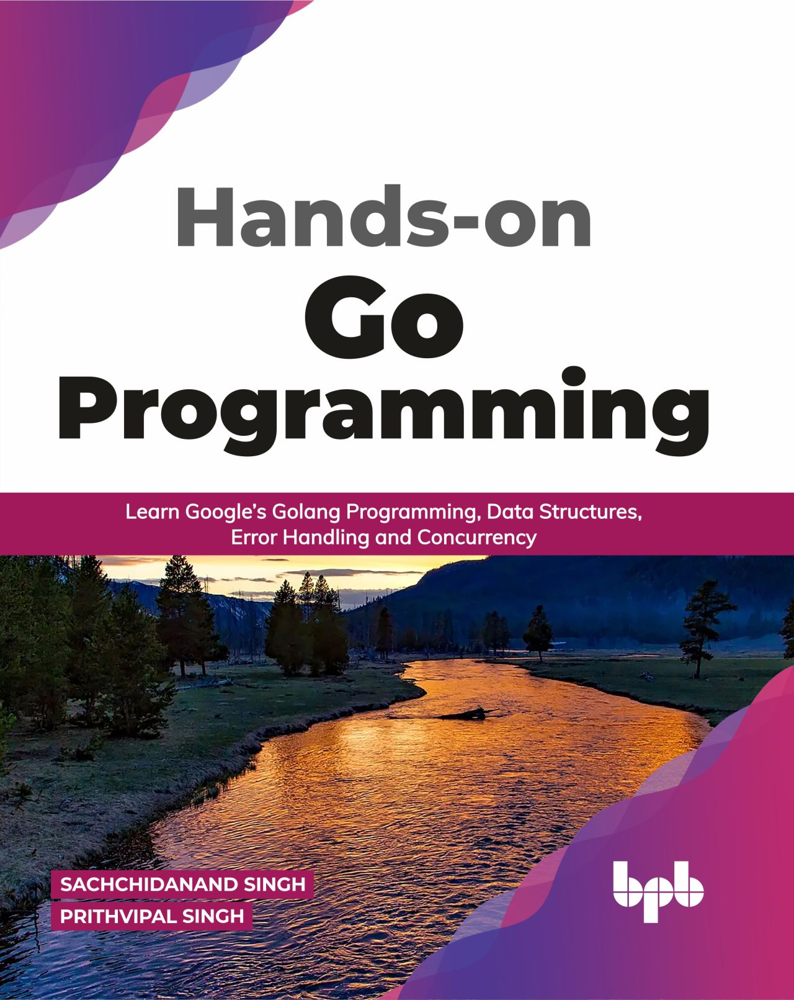

# Hi there 👋

<!--
**Prithvipal/Prithvipal** is a ✨ _special_ ✨ repository because its `README.md` (this file) appears on your GitHub profile.

Here are some ideas to get you started:

- 🔭 I’m currently working on ...
- 🌱 I’m currently learning ...
- 👯 I’m looking to collaborate on ...
- 🤔 I’m looking for help with ...
- 💬 Ask me about ...
- 📫 How to reach me: ...
- 😄 Pronouns: ...
- ⚡ Fun fact: ...
-->

## My Book: Hands on Go Programming

Simple and easy to understand guide to learn Golang. This book will teach you Golang in simplest way with hands on examples. It is useful for beginners and experts.

**You can find this book here:**

- **Kindle Edition**
  - [In India](https://amzn.to/3uXFoME)
  - [Outside India](https://amzn.to/2OyCuNp)

- **Paperback**
  - [In India](https://amzn.to/3sWROTb)
  - [Outside India](https://amzn.to/3ribxMw)

- **Free Preview:**
  - [eBook](http://bit.ly/3rl7VcC)
  - [Print](https://bit.ly/3rli0Gq)

<!--  -->
